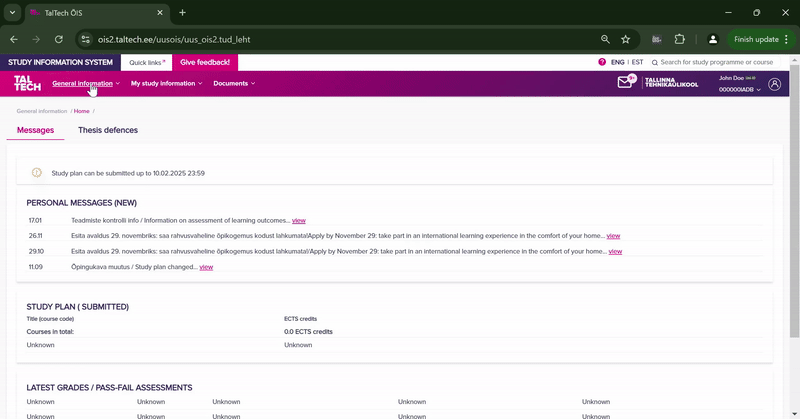

# Better Navigation for TalTech and TLÜ ÕIS

This Chrome extension enables a better navigation experience for the study information systems (ÕIS)
of Tallinn University of Technology (TalTech) and Tallinn University (TLÜ). By default, the links in these systems cannot be opened in a new tab
because they rely on JavaScript functions in their href attributes.
This extension makes it possible to open those links in new tabs, improving usability.

## Features

- **Open links in new tabs:** Allows users to open links in the ÕIS systems in new browser tabs.
- **Simple toggle:** The extension can be easily enabled or disabled with a single click on the extension icon (refresh
  needed).

## Installation

### Chrome Web Store

1. Go to the [Chrome Web Store page](https://chromewebstore.google.com/detail/better-%C3%B5is-navigation/eilekaogmoefkccfigeaajlnabemldnj) of the extension.
2. Click on the `Add to Chrome` button.

### Manual Installation

1. Clone this repository or download the source code as a ZIP archive.
2. Open the Extension Management page by navigating to `chrome://extensions`.
    - The Extension Management page can also be opened by clicking on the Chrome menu, hovering over `Extensions`, and
      selecting `Manage Extensions`.
3. Enable Developer Mode by clicking the toggle switch next to `Developer mode`.
4. Click the `Load unpacked` button and select the extension directory.
5. The extension should now be installed and visible in the extensions list.

## Usage

Once the extension is installed, it will automatically modify the links
on the TalTech and TLÜ ÕIS websites, allowing them to be opened in new tabs.
You can toggle the extension on or off by clicking on the extension icon
in your browser's toolbar. The icon will be colored when the extension is enabled
and grayed out when it is disabled.

- **Enabled:** The extension is active and links can be opened in a new tab by right- or middle-clicking them.
- **Disabled:** The extension is inactive and links will behave as usual.

## Permissions

This extension requires the following permissions:

- **storage**: Allows the extension to store and retrieve data (such as enabled/disabled state).
- **scripting**: Enables the extension to inject scripts into the pages of TalTech and TLÜ ÕIS for link modification.
- **tabs**: Allows the extension to interact with browser tabs to detect when a page has finished loading.

## License

This project is licensed under the MIT License - see the [LICENSE](LICENSE) file for details.

## Contributing

Contributions are welcome! If you have any suggestions, bug reports, or feature requests,
please open an issue on GitHub. If you would like to contribute code, please fork the repository
and submit a pull request.
